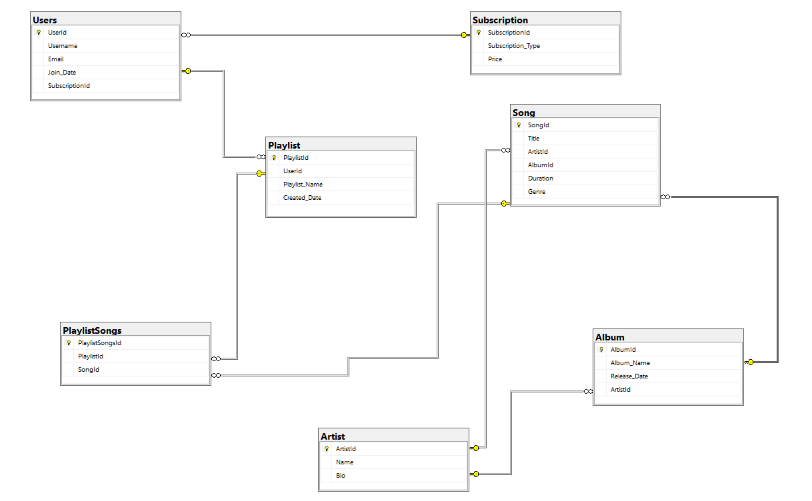

# Tunify Platform

## Introduction

Tunify Platform is an Empty .NET Core Web Application to enhance your music experience. It allows users to create and manage playlists, explore various songs, albums, and artists, and subscribe to different subscription plans. With Tunify Platform, you can organize your favorite songs into playlists, discover new music, and keep track of your musical journey.

## Tunify ERD Diagram

## Overview of Relationships

The Tunify Platform database schema is structured to maintain a well-organized and efficient relationship between various entities. Below is an overview of the relationships between the entities in the Tunify Platform:

1. **Users**
   - Each user is uniquely identified by UserId.
   - Users have a one-to-many relationship with playlists, meaning a user can create multiple playlists.
   - Each user has a subscription identified by SubscriptionId.

2. **Subscriptions**
   - Subscriptions are uniquely identified by SubscriptionId.
   - Each subscription has a type and a price.
   - Users are linked to subscriptions via SubscriptionId.

3. **Playlists**
   - Playlists are uniquely identified by PlaylistId.
   - Each playlist is associated with a specific user via UserId.
   - Playlists have a one-to-many relationship with PlaylistSongs, meaning a playlist can contain multiple songs.

4. **Songs**
   - Songs are uniquely identified by SongId.
   - Each song is associated with an artist and an album via ArtistId and AlbumId respectively.
   - Songs have a many-to-many relationship with playlists, managed through the PlaylistSongs table.

5. **Albums**
   - Albums are uniquely identified by AlbumId.
   - Each album is associated with an artist via ArtistId.

6. **Artists**
   - Artists are uniquely identified by ArtistId.
   - Artists can have multiple albums.

7. **PlaylistSongs**
   - The PlaylistSongs table serves as a junction table for the many-to-many relationship between playlists and songs.
   - Each entry in PlaylistSongs is uniquely identified by PlaylistSongsId and contains foreign keys to PlaylistId and SongId.

In summary, the database design ensures a flexible and scalable structure, allowing users to manage their musical content efficiently while maintaining the integrity and relationships of the data.

## The Repository Design Pattern

### Overview of the Repository Pattern

The Repository Pattern is a design pattern that encapsulates the logic needed to access data sources, providing a central place to manage data access. It abstracts the data layer from the rest of the application by acting as a mediator between the domain and data mapping layers. In essence, the Repository Pattern allows the application to communicate with the database through well-defined methods, making the application more modular and easier to maintain.

### Benefits of the Repository Pattern

1. **Separation of Concerns:** The Repository Pattern separates the data access logic from the business logic, leading to cleaner, more maintainable code. It keeps the business logic in controllers or services and relegates data operations to repositories.

2. **Improved Testability:** By using repositories, you can easily mock the data layer during unit testing. This allows you to test your business logic independently of the actual database.

3. **Centralized Data Access Logic:** Repositories centralize the data access logic for a particular entity in one place. This reduces code duplication and ensures that data access logic is consistent across the application.

4. **Flexibility and Scalability:** The Repository Pattern allows you to change the underlying data source without affecting the business logic. This makes your application more flexible and scalable, as you can switch databases or use different data storage mechanisms with minimal code changes.

5. **Decoupling of the Data Layer:** Repositories decouple the data layer from the rest of the application. This means that changes in the database schema or underlying data storage do not directly affect the business logic, providing a more robust and resilient application structure.

### Implementing the Repository Pattern in Tunify Platform

In the Tunify Platform, the Repository Pattern has been implemented to manage data access for entities such as Users, Playlists, Songs, and Artists. This has improved the modularity of the application by allowing data operations to be handled in a consistent and centralized manner through repositories.

For each entity (User, Playlist, Song, and Artist), a corresponding repository interface and its implementation were created. The controllers were refactored to interact with these repositories instead of directly with the `DbContext`. This approach has simplified the code in the controllers and made the application more modular and easier to test.

## Navigation and Routing Functionalities
We enhanced the Tunify Platform with advanced navigation and routing features. These improvements streamline user interactions and ensure a more intuitive experience within the application:

* **Dynamic Routing**: Routes are generated dynamically based on user actions and application state. This allows for seamless transitions between different views and resources.
* **Parameterized Routes**: Support for parameterized routes, such as playlist IDs and artist names, enables direct access to specific content within the application.
* **Route Guards**: Implemented route guards to control access to certain areas of the application based on user authentication and roles.
* **Navigation Service**: Introduced a centralized navigation service to manage routing logic and transitions, ensuring consistency across the application.

### Playlist-Song Relationship
- Users can add songs to a playlist via the `POST /api/PlayLists/{playlistId}/songs/{songId}` endpoint.
- Songs associated with a playlist can be retrieved using the `GET /api/playlists/{playlistId}/songs` endpoint.

### Artist-Song Relationship
- Users can associate songs with an artist via the `POST /api/Artists/{artistId}/songs/{songId}` endpoint.
- All songs by an artist can be retrieved using the `GET /api/Artists/{artistId}/songs` endpoint.

## Swagger UI Integration
Swagger UI offers a visual interface for interacting with the Tunify Platform's API. It automatically generates and displays the API's documentation, making it easier to explore and test various endpoints.

## How to Access the Swagger UI
1. **Run the Tunify Platform application** by starting the project in Visual Studio.
2. **Navigate to the Root URL:**
   - Open your web browser.
   - The Swagger UI will be displayed, showing the API documentation.

## Using Swagger UI
- **Explore API Endpoints:** The Swagger UI lists all available endpoints, allowing you to see the routes, methods, and descriptions.
- **Test API Functionality:** You can directly test the API by sending requests to endpoints and viewing the responses.
- **View Request/Response Models:** Detailed information about request parameters and response models is provided, helping you understand how to interact with the API.

This integration enhances the developer experience by providing a centralized, interactive platform for API documentation and testing.

## Identity Implementation

### Overview

The Tunify Platform integrates ASP.NET Core Identity to manage user authentication and authorization, allowing for secure user registration, login, and logout functionalities. ASP.NET Core Identity is a comprehensive system that provides essential features such as password hashing, user role management, and authentication tokens, ensuring that user data is handled securely.

### How to Use the Registration, Login, and Logout Features

1. **Registration**: 
   - To create a new user account, the application offers a registration endpoint. Users need to provide a username, email, and a secure password that meets the platform’s complexity requirements. Upon successful registration, the user's details are stored in the database, and the system returns a confirmation response, including the user's unique identifier.

2. **Login**:
   - Users can log in by submitting their username and password to the login endpoint. The system validates the credentials against the stored data. If the credentials are correct, the system authenticates the user and generates an authentication token or session, allowing the user to access protected resources within the application. The login process secures user sessions, ensuring that sensitive data is protected during transmission.

3. **Logout**:
   - Logging out of the platform is straightforward. When a user requests to log out, the system invalidates the current session or token, effectively ending the user's authenticated session. This ensures that no further actions can be performed under the user’s identity until they log in again. Logging out is an essential step in maintaining security, especially on shared or public devices.

### Instructions

- **Registration**: Send a POST request to the registration endpoint with the required user details.
- **Login**: Use the login endpoint to authenticate by sending the username and password. The system will respond with the user's details if the login is successful.
- **Logout**: Invoke the logout endpoint to end the current session, which will return a confirmation message indicating successful logout.

## JWT-Based Authentication Setup

## Overview

JWT (JSON Web Token) is a standard for securely transmitting information between a client and a server. In the Tunify Platform, JWT-based authentication is used to secure API endpoints, ensuring that only authenticated users can access certain resources.

## Setting Up JWT Authentication

### 1. Configure JWT Authentication

- Add JWT authentication services in the `Startup.cs` file by configuring the `JwtBearer` options with the necessary parameters like the issuer, audience, and signing key.

### 2. Generate JWT Tokens

- After successful login, the application generates a JWT token, which the client uses in subsequent requests to access protected resources.

### 3. Token Validation

- Ensure that each request to a protected endpoint includes the JWT token in the `Authorization` header. The server will validate the token to authenticate the user.

## Securing API Endpoints

### 1. Apply Authorization Policies

- Use the `[Authorize]` attribute on controllers or actions to restrict access to authenticated users.

### 2. Role-Based Authorization

- Assign roles to users and use role-based authorization to control access to certain features or resources within the application.

## Managing Roles and Claims

### Roles

- Assign roles to users to group permissions. For example, you can have roles like "Admin," "User," and "Guest."

### Claims

- Claims represent additional user information, such as permissions or preferences. You can add claims to a user's JWT token to further customize their access within the application.

### How to Add Roles and Claims

- **Define Roles**: Use the `RoleManager` service to define new roles and assign them to users.
- **Add Claims**: Use the `UserManager` service to add claims to a user's identity.

## Conclusion

The Tunify Platform is a robust and secure application designed to enhance the user's music experience while ensuring data security and scalability. With JWT-based authentication, role and claim management, and a structured database, Tunify offers a comprehensive solution for managing and exploring music. This documentation provides a detailed guide to the platform's structure, design patterns, and security features, ensuring developers can easily understand and extend the application.
